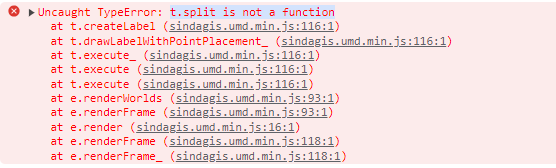
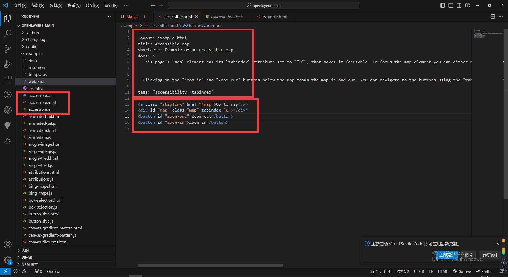

## openlayers问题记录汇总

#### t.split is not a function

**截图**

**使用场景**

创建 `point` 要素，并给style样式设置text时

**原因及解决**

`text` 应该接收一个字符串，出现这个问题可能是传给 `text` 的值为 `number` 或其他非字符串类型的值。

改成字符串类型的就可以了，比如，如果是数字，调用 `toString` 方法就行了。

#### 官网示例是如何实现的

**截图**

**猜测**

应该是通过打包之后整合成了一个html文件。

先不管，回头再看源码是如何实现的，暂时先以学习为目的做出来。
